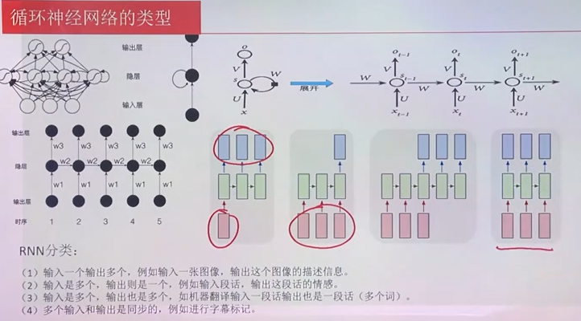
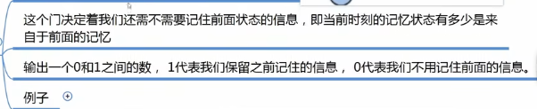
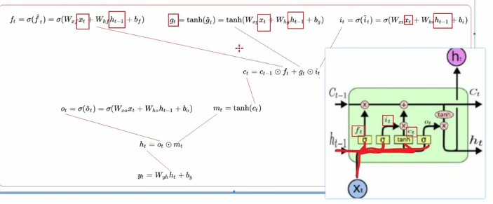

# Dl

CNN

LeNet

IMageNet

VGGNet

Google Net

## MP模型

MP模型的权值w和偏置b都是认为给定的， 所以此模型不存在学习的说法

## 感知机

**感知机与MP模型的区别**

- 输入可以不是离散型
- 激活函数可以不再是简单的阈值函数

单层感知机引入了损失函数， 

多层感知机通过增加层数解决非线性问题， 但是需要人为固定一层参数，只能训练其中一层。

## 前馈神经网络

## CNN

卷积神经网络

## RNN

### 循环神经网络

 

双曲正切函数

当x 很大时 ， 曲线趋于平行，梯度为零，产生梯度消失。

https://mp.weixin.qq.com/s/mLic_aC0FgCVAIP4lYh7Dw 

**递归神经网络**

二者都可以处理有序列的问题

为了加强记忆能力，提出了LSTM

### 长短期记忆网络LSTM （long short -term Memory）   

解决长期及远距离的依赖关系     数据之间存在前后依赖关系， 有序列关系

如果预测对象同时取决于过去和未来，可以选择双向结构， 如双向LSTM

ft 遗忘门

it 更新门

过滤新状态 无关特征量   产生新的记忆内容 

+

ot输出门

tan h提取当前记忆中需要的部分 输出为Ht

相关视频 

https://www.bilibili.com/video/BV1qM4y1M7Nv?p=4&spm_id_from=pageDriver&vd_source=33d4f5ace56eb158f8b3252ac671ebfe

## 门控循环[神经网络](https://so.csdn.net/so/search?q=神经网络&spm=1001.2101.3001.7020)（gated recurrent neural network）

## 深度信念网络DBN

主要有两个部分: 

1. 堆叠的受限玻尔兹曼机(Stacked RBM)
2. 一层普通的前馈网络。

DBN最主要的特色可以理解为两阶段学习，

- 阶段1用堆叠的RBM通过无监督学习进行预训练(Pre-train)，
- 阶段2用普通的前馈网络进行微调。

神经网络的精髓就是进行特征提取  

## 径向基网络(Radial Basis Network (RBN)) 

## 深度前馈(Deep Feed-forward (DFF)) 

## 生成式对抗网络 GAN

解决了非监督学习中的著名问题，给定一批样本训练一个系统， 能够生成类似的样本

**生成模型**

生成方法和判别方法， 

生成方法通过观测数据学习样本与标签的联合概率分布（X，Y）训练好的模型能够生成符合样本分布的新数据，它可以用于有监督 和 无监督学习，

生成模型是指我们可以根据任务，通过模型训练由输入的数据生成文字， 图像，视频等教程。

本质上是一种极大似然估计， 用于产生指定分布数据的模型，生成模型的作用是捕捉样本数据的分布， 将原输入信息的分布情况经过极大似然估计中参数的转化来讲训练偏向转换为指定分布的样本。

**判别模型**  实际上是一个二分类， 会对生成模型生成的图像等数据进行判断， 判断其是否是真实的训练数据中的数据。

判别方法 由数据直接学习决策函数或这条件概率分布作为预测的模型

有生成器和判别器组成，

生成器生成满足目标分布映射关系的新样本，

判别器用来区别实际数据分布和生成器产生的数据分布

 

定义损失函数  固定生成器或者判别器中的一个 调整另一个中的参数

GAN固定一个 另一个无法升级  梯度消失

## 自动编码器 Auto-encoder

、

## 变分自动编码器(Variational Autoencoder (VAE)) 

## 去噪自动编码器(Denoising Autoencoder (DAE) 

## 稀疏自动编码器(Sparse Autoencoder (SAE)) 

## attention机制

 

## 前向传播算法与反向传播算法

https://zhuanlan.zhihu.com/p/71892752

## 反卷积神经网络(Deconvolutional Neural Networks (DN))

## 深度卷积网络(Deep Convolutional Network (DCN)) 

## 波茨曼机(Boltzmann Machine (BM)):

## 受限玻尔兹曼机(Restricted Boltzmann Machine (RBM))

## 霍菲特网络(Hopfield Network (HN)):

## 深度卷积逆图形网络(Deep Convolutional Inverse Graphics Network (DC-IGN)) 

## 深度残差网络(Deep Residual Network (DRN)) 

## Kohonen网络(Kohonen Networks (KN) )

## 支持向量机(Support Vector Machines (SVM)):

## 神经图灵机(Neural Turing Machine (NTM))

## 回声状态网络(Echo State Network (ESN)) 

## 自回归网络

## 注意力机制

**给予不同的项一定的比重，比重越大越聚焦于其对应的value值上， 即权重代表了信息的重要性，而value是其对应的信息。**

**从大量信息中有选择的筛选出 少量重要信息，并且聚焦到这些重要信息中，忽略大多不重要的信息。**

本质上都是分而治之的思想。

### 具体的计算机制

  

**SELF Attention**

## PNN模型

 

